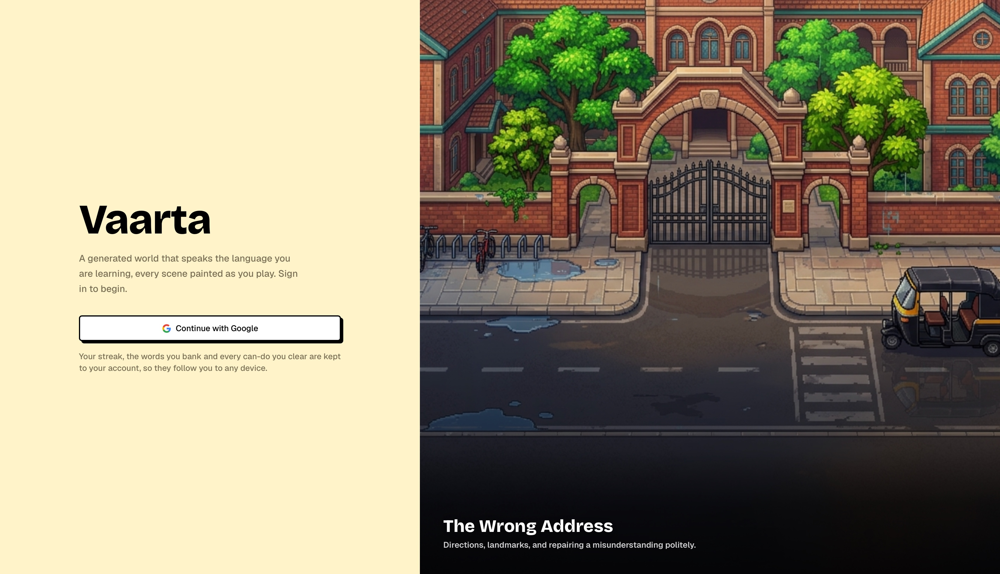
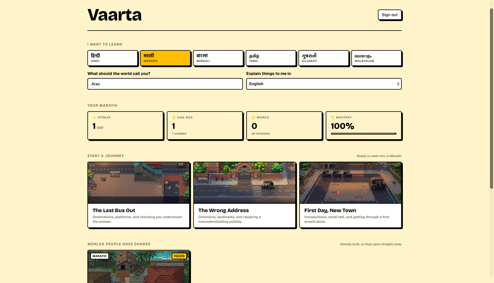
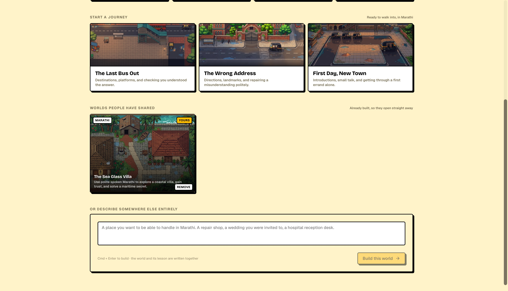
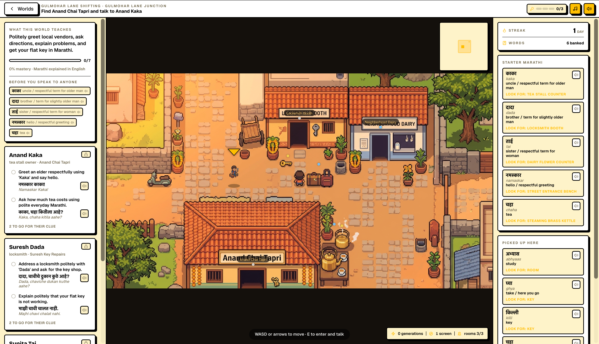
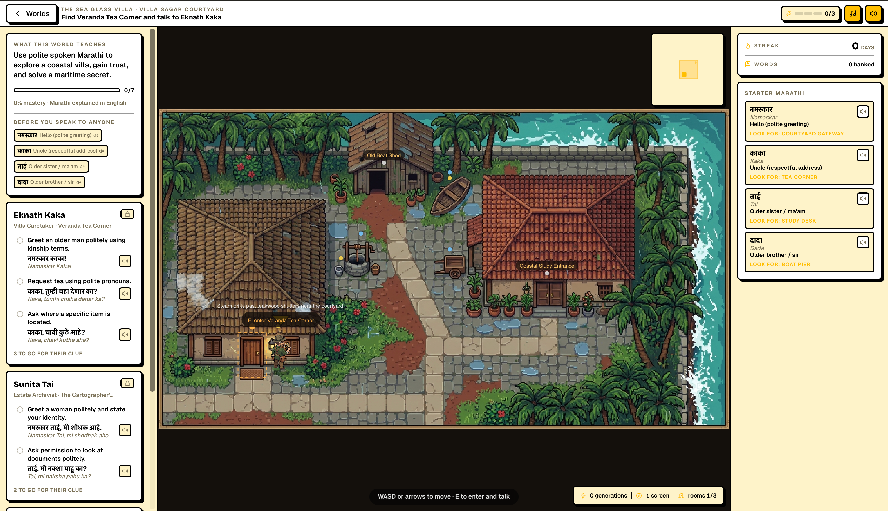
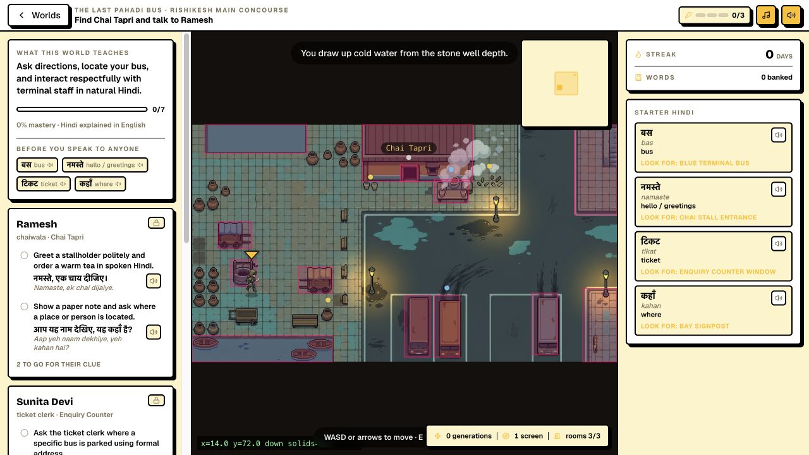
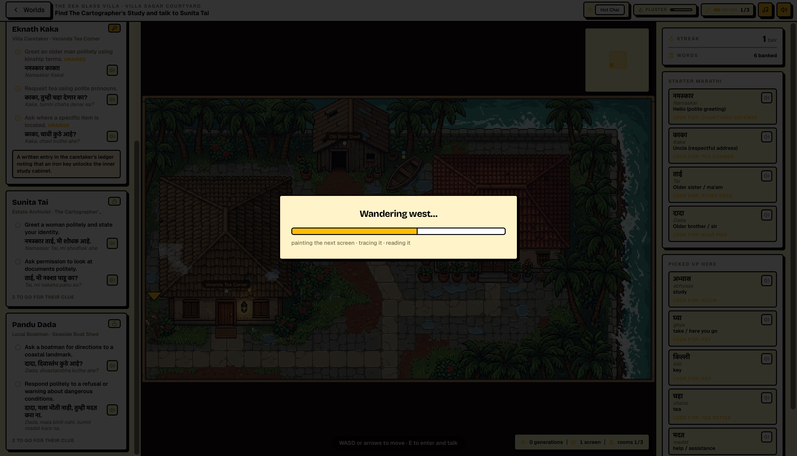
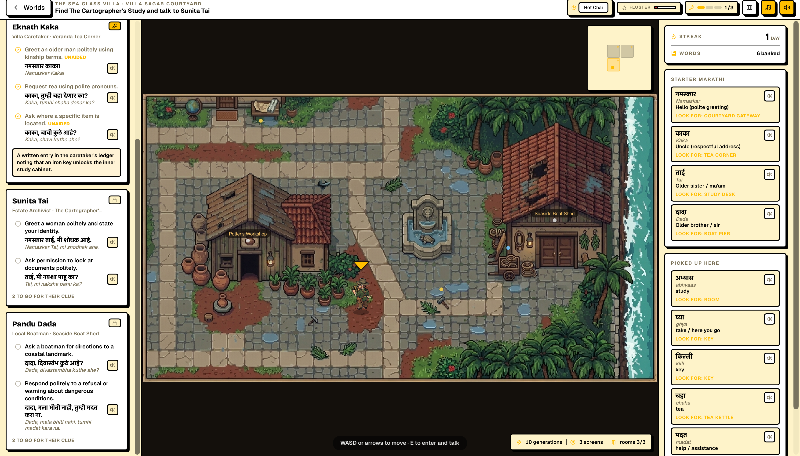
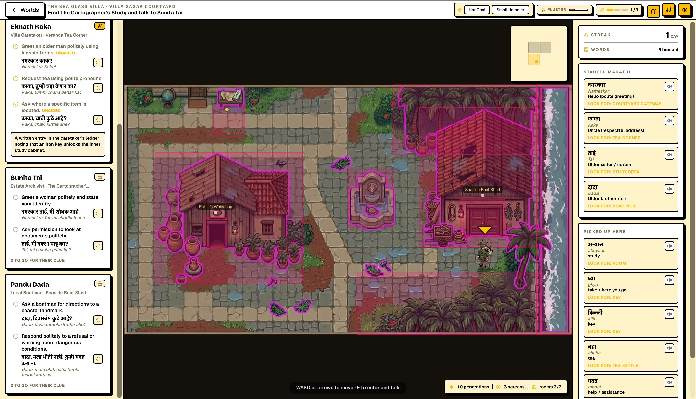
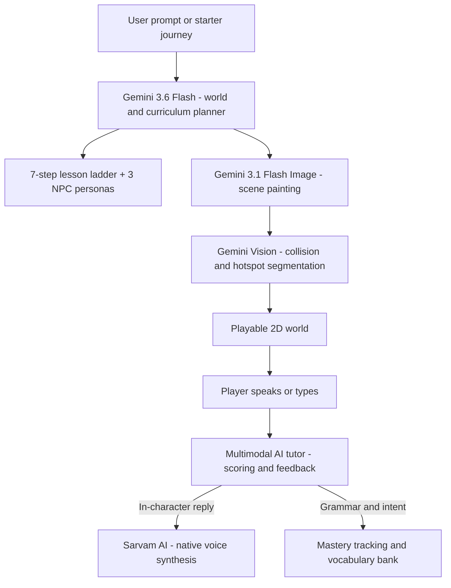

<div align="center">

# Vaarta

**Learn Indian languages by living in them.**

An AI-powered pixel-art RPG where every conversation is a real language lesson.

</div>

---

Live world creation according to user prompt :

<div align="center">
<video src="https://github.com/user-attachments/assets/93512025-d46f-4677-b307-84adbd190ea7" controls="controls" width="100%"></video>
</div>

---

## About

Vaarta drops you into a living Indian town that speaks your target language. No flashcards - just real conversations with characters who have their own personalities, occupations, and ways of speaking.

Pick a starter journey like _"The Last Pahadi Bus"_ or describe your own scenario, and Vaarta will build an entire playable world around it:

- **World authoring** - Generates lore, three NPCs with distinct social registers, and a 7-step CEFR-aligned lesson plan from a single prompt.
- **Pixel art generation** - Paints scenes in real time using Gemini's image models, styled to match regional Indian architecture.
- **Computer vision** - Analyzes generated artwork to extract walkable paths, solid obstacles, doorways, and interactive objects. No manual level design.
- **Conversational tutoring** - Speak or type to NPCs. A multimodal AI tutor evaluates grammar, script usage, vocabulary, and communicative intent.
- **Native voice synthesis** - Every NPC is voiced with native accents across 6 Indian languages via Sarvam AI.
- **Spaced repetition** - Words encountered in conversation are banked and scheduled for review at increasing intervals.

## Screenshots

|                                                                                                          |                                                                                                          |
| :------------------------------------------------------------------------------------------------------: | :------------------------------------------------------------------------------------------------------: |
|              <br><sub>Sign-in page</sub>               |           <br><sub>Learner dashboard</sub>           |
| <br><sub>Starter journeys and custom generator</sub> |   <br><sub>Custom world - "Gulmohar Lane"</sub>   |
| <br><sub>In-world exploration and NPC dialogue</sub>  | <br><sub>Starter journey - "The Last Pahadi Bus"</sub> |
|      <br><sub>Screen expansion and scoring</sub>      |   <br><sub>Multi-screen navigation and minimap</sub>   |
|    <br><sub>Computer vision collision tracing</sub>     |                                                                                                          |

---

## Architecture



Each world ships with a **Can-Do lesson ladder** - 7 progressive objectives based on the CEFR framework, from basic greetings to negotiation and cultural nuance.

Generated artwork is analyzed by **Gemini Vision** to produce walkable polygons, solid boundaries, interactive hotspots, and screen-edge portals, all without manual tilemap work.

---

**Supported Languages :** Hindi, Marathi, Malayalam, Tamil, Bengali, Gujarati

---

## Tech Stack

| Layer             | Technology                                      |
| :---------------- | :---------------------------------------------- |
| Framework         | Next.js 16 (App Router, Turbopack)              |
| AI                | Google Gemini (3.6 Flash text, 3.1 Flash Image) |
| Voice             | Sarvam AI bulbul:v3                             |
| Auth and Database | Supabase (PostgreSQL, RLS, Google OAuth)        |

---

## Getting Started

### Prerequisites

- Node.js 22+
- [Gemini API key](https://aistudio.google.com/)
- [Sarvam AI API key](https://www.sarvam.ai/)
- [Supabase project](https://supabase.com/)

### Setup

```bash
git clone https://github.com/Arav-Arun/Vaarta.git
cd Vaarta
npm install
cp .env.example .env.local
```

Fill in your API keys in `.env.local`, then run `supabase/SETUP.sql` in your Supabase project's SQL Editor to initialize the database.

Add these redirect URLs in Supabase under **Auth > URL Configuration**:

- `http://localhost:3000/auth/callback`
- `https://your-domain.vercel.app/auth/callback`

```bash
npm run dev
```

Open [localhost:3000](http://localhost:3000).

### Custom World Generation

On the live demo, custom world generation is disabled to manage Gemini image API costs. Starter journeys are fully playable without it. To generate your own worlds locally, set `ENABLE_CUSTOM_WORLDS=true` and `NEXT_PUBLIC_ENABLE_CUSTOM_WORLDS=true` in `.env.local` with a billing-enabled Gemini API key.

---

## Project Structure

```
app/
├── api/vaarta/         API routes - world, turn, voice, screen, progress
├── auth/callback/      Supabase OAuth callback
├── login/              Sign-in page
└── w/[id]/             Published world viewer

components/
├── Home.tsx            Dashboard, progress, journeys, world generator
├── VaartaWorld.tsx     2D game engine - canvas, movement, NPC interaction
├── Minimap.tsx         Procedural minimap
└── MobileControls.tsx  Touch controls

lib/vaarta/
├── planner.ts          World and curriculum generation
├── tutor.ts            Conversational scoring
├── languages.ts        Language catalogue and script detection
└── progress.ts         Server-side progress persistence
```
